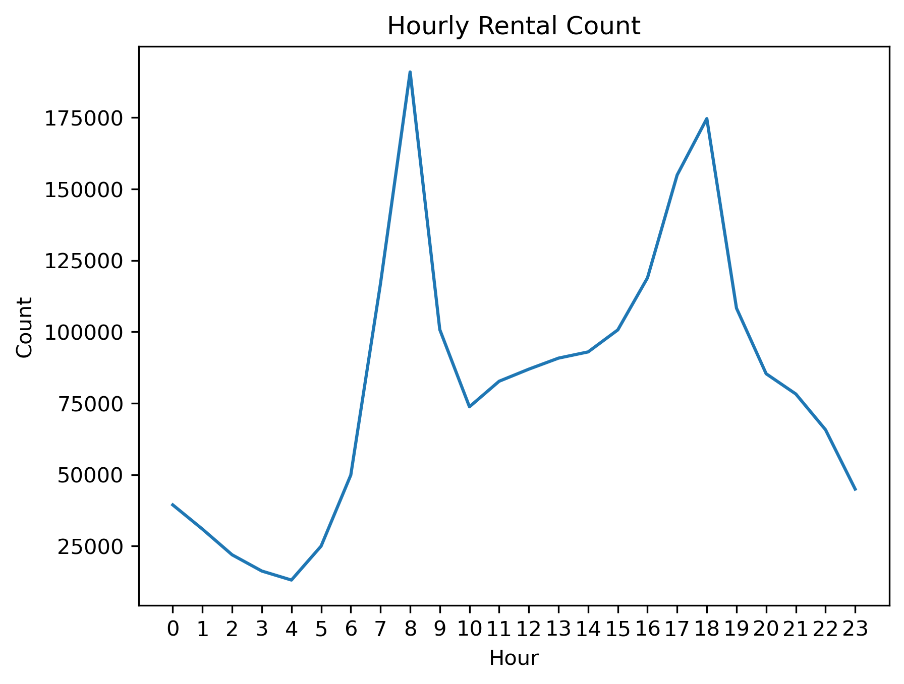
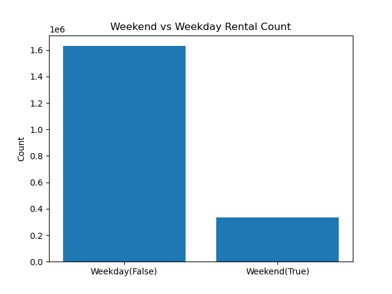
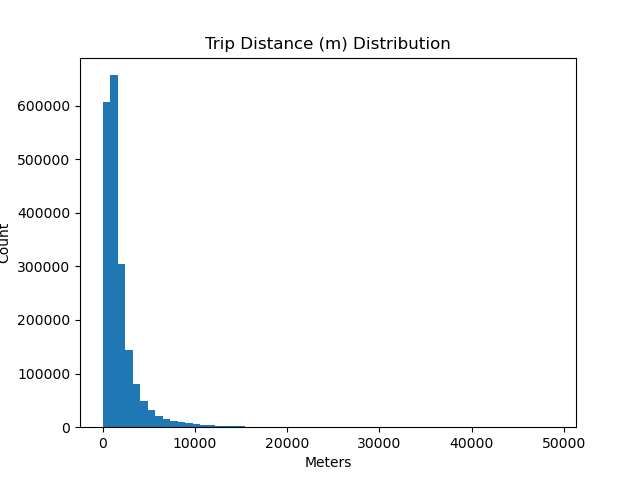
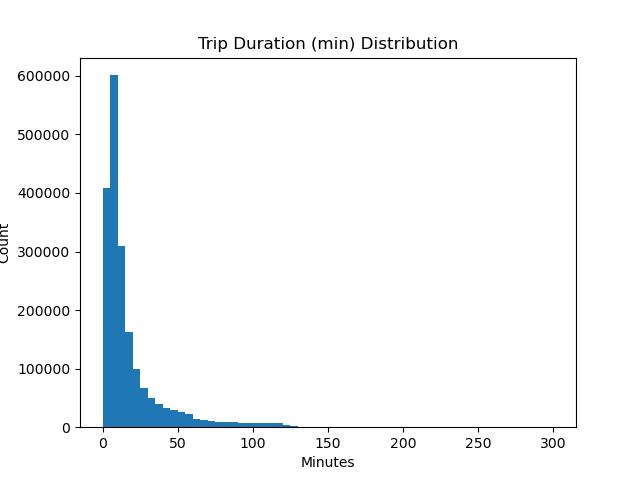
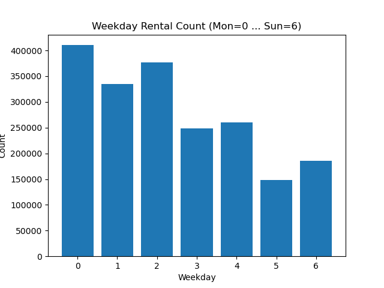
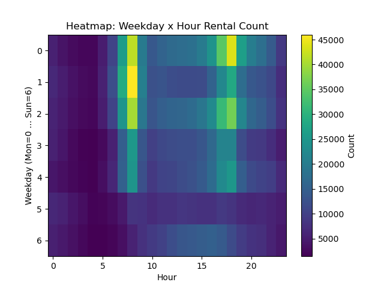

# 🚲 서울시 따릉이 이용 패턴 분석
> 출퇴근 수단으로서의 공공자전거 — 200만 건 이용이력 EDA

   

---

## 📌 프로젝트 개요

서울시 공공자전거 따릉이의 2025년 12월 이용이력 데이터(약 200만 건)를 분석하여,  
**"따릉이는 주로 출퇴근 수단으로 쓰이는가?"** 라는 질문에 데이터로 답합니다.

---

## 🔍 핵심 인사이트

### 1. 출퇴근 피크가 뚜렷하게 나타남


- **오전 8시**, **오후 18시**에 이용량 두 배 급증
- 전형적인 출퇴근 패턴 — 대중교통 연계 수단으로 활용됨을 시사

### 2. 평일 이용량이 주말의 5배


- 평일 약 163만 건 vs 주말 약 33만 건
- 레저·여가 목적보다 **통근 목적**이 압도적

### 3. 단거리 이용에 집중
| 지표 | 값 |
|------|-----|
| 이용거리 중앙값 | 약 1~2km |
| 이용시간 중앙값 | 약 10분 이하 |
| 주요 이용 패턴 | 5km 이하 단거리 |




### 4. 요일별 — 주 초반에 집중


- 월요일 이용량이 가장 높고 주말로 갈수록 감소
- 주 초반 출근 빈도가 높은 직장인 이용 패턴 반영

### 5. 요일 × 시간 히트맵


- 평일(0~4) 8시, 18시에 집중된 노란색 셀이 출퇴근 피크를 명확히 시각화
- 주말(5~6)은 전 시간대에 걸쳐 균일하게 낮은 수치

---

## 🗂 데이터

| 항목 | 내용 |
|------|------|
| 출처 | [서울 열린데이터광장](https://data.seoul.go.kr) |
| 파일명 | 서울특별시 공공자전거 이용정보(시간대별)_202512 |
| 기간 | 2025년 12월 |
| 규모 | 약 200만 건 |
| 주요 컬럼 | 대여일시, 이용시간(분), 이용거리(M) |

---

## ⚙️ 데이터 파이프라인

```
원본 CSV (cp949)
    │
    ▼
[preprocess.py]
    ├── 타입 변환 (대여일시 → datetime)
    ├── 결측치 제거
    ├── 중복 제거
    ├── 이상치 제거 (이용시간 300분 초과, 이동거리 50km 초과)
    └── 파생변수 생성 (hour, weekday, is_weekend)
    │
    ▼
processed_2512.parquet
    │
    ▼
[analysis.py]
    └── 시각화 7종 생성
```

---

## 📁 프로젝트 구조

```
SEOUL_BIKE_PROJECT/
│
├── data/
│   └── processed_2512.parquet   # 전처리 완료 데이터
│
├── images/
│   ├── hourly_rental.png        # 시간대별 대여건수
│   ├── Figure_1.png             # 요일별 대여건수
│   ├── Figure_2.png             # 평일 vs 주말
│   ├── Figure_3.png             # 이용시간 분포
│   ├── Figure_4.png             # 이용거리 분포
│   └── Figure_5.png             # 요일×시간 히트맵
│
├── preprocess.py                # 데이터 전처리
├── analysis.py                  # 분석 및 시각화
└── README.md
```

---

## 🚀 실행 방법

```bash
# 1. 의존성 설치
pip install pandas matplotlib pyarrow

# 2. 전처리 실행 (RAW_PATH를 본인 CSV 경로로 수정)
python preprocess.py

# 3. 분석 및 시각화
python analysis.py
```

---

## 📝 결론

> 따릉이는 **출퇴근 단거리 이동 수단**으로 정착되어 있음.  
> 오전 8시·오후 18시 피크, 평일 집중, 5km 이하 단거리 패턴이 이를 일관되게 뒷받침함.  
> 향후 지하철역·버스정류장 인근 대여소 수요 예측 모델로 확장 가능.

---

## 🛠 사용 기술

`Python` `Pandas` `Matplotlib` `Parquet` `VS Code`
